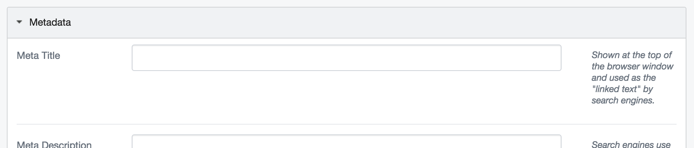

# MetaTitle
[](https://travis-ci.org/kinglozzer/silverstripe-metatitle) [](https://packagist.org/packages/kinglozzer/metatitle) [](https://packagist.org/packages/kinglozzer/metatitle) [](https://packagist.org/packages/kinglozzer/metatitle)

Re-adds the “Meta Title” field that was removed in SilverStripe 3.1.

By:
Loz Calver - [Bigfork Ltd](http://www.bigfork.co.uk/).

## Contributing:

Translations were pulled from SilverStripe CMS v3.0.2 (before the `SiteTree.METATITLE` entity was removed). Pull requests are welcome for improving those translations and adding `SiteTree.METATITLEHELP` translations.

## Requirements:

This module requires SilverStripe Framework & CMS version 4 and up:

- `"silverstripe/cms": "^4"`
- `"silverstripe/framework": "^4"`

For a SilverStripe 3 compatible version, please use the 1.x line of releases (with composer, require version `^1.0`).

## Installation:

Installation with Composer is preferred, but not required. Both methods of installation require a `dev/build`.

#### Composer

```bash
$ composer require kinglozzer/metatitle:^2.0
```

#### ZIP Download

Simply download the [zip version](https://github.com/kinglozzer/silverstripe-metatitle/archive/master.zip) of this repository, extract it, and copy the directory into your SilverStripe installation.

## Usage:

#### CMS

Content authors can edit the meta title via the new “Title” field that’s added to the “Metadata” toggle fields:



#### Templates

##### Automatically including the meta title

The simplest way to ensure that the meta title is included is to call `$MetaTags` in the `<head>` if your template. This will include the meta title (falling back to page title if meta title is not set) and the site name in the format: `Meta title » Your Site Name`.

The format can be customised by changing the `Kinglozzer\SilverStripeMetaTitle\MetaTitleExtension.title_format` config setting. For example, to change the » to a hyphen:

```yml
Kinglozzer\SilverStripeMetaTitle\MetaTitleExtension:
  title_format: '$MetaTitle - $SiteConfig.Title'
```

The `title_format` string is rendered as a template, so you can use globally available variables like `$SiteConfig`. `$MetaTitle` is dynamically populated with the meta title (falling back to page title if meta title is not set).

##### Manually including the meta title

You can access the meta title directly with the `$MetaTitle` variable, should you wish to control how the meta title is output directly in your template. You will need to call `$MetaTags(false)` to ensure that SilverStripe doesn’t automatically output the `<title>` tag too:

```html
<title><% if $MetaTitle %>$MetaTitle<% else %>$Title<% end_if %> &raquo; $SiteConfig.Title</title>
$MetaTags(false)
```
